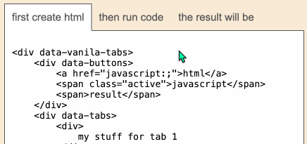

# What is it?

It would be nice to have some easy to use tabs system for raw html which would work declaratively just after loading one js and one css file, without need for manual javascript to attach event.
Also that should also work for all dynamically created formation of html tags introduced to the page after initial library is loaded.

So this is that. Have fun, just go and see demo page: stopsopa.github.io/tabs/

# Doc mostly outdated

.. docs in this README.md is outdated but visit stopsopa.github.io/tabs/ this is up to date and self explanatory. There is not much magic behind it, just around 270 lines of vanilla js. Have fun.

Documentation was created for old version of this component created back in 2015 based on jQuery.
I'll update it later

Current [version](https://stopsopa.github.io/tabs/) was rewritten to use to use vanilla [event delegation](https://developer.mozilla.org/en-US/docs/Learn/JavaScript/Building_blocks/Event_bubbling#event_delegation) technique
.

# versions

## latest (not recommended to use)

```html
<link
  rel="stylesheet"
  href="https://stopsopa.github.io/tabs/vanilla-tabs.css"
/>
<script src="https://stopsopa.github.io/tabs/vanilla-tabs.js?vanilla-tabs-autoenable"></script>
// presence of 'vanilla-tabs-autoenable' in query string triggers autobinding
and watch mode // so next section is not needed (.bind(), .active(),
.watchMutationsEnable())

<script>
  const unbind = vanillaTabs.bind();
  vanillaTabs.active();

  // that will trigger .activate() everytime new [data-buttons]
  // will be created anywhere in the document
  vanillaTabs.watchMutationsEnable();
</script>
```

## v1.0.0

```html
<link
  rel="stylesheet"
  href="https://cdn.jsdelivr.net/gh/stopsopa/tabs@v1.0.0/vanilla-tabs.css"
/>
<script src="https://cdn.jsdelivr.net/gh/stopsopa/tabs@v1.0.0/vanilla-tabs.js"></script>
```

## v1.0.1

```html
<link
  rel="stylesheet"
  href="https://cdn.jsdelivr.net/gh/stopsopa/tabs@v1.0.1/vanilla-tabs.css"
/>
<script src="https://cdn.jsdelivr.net/gh/stopsopa/tabs@v1.0.1/vanilla-tabs.js?vanilla-tabs-autoenable"></script>
```

To refresh jsdelivr visit: https://purge.jsdelivr.net/gh/stopsopa/tabs@v1.0.1/vanilla-tabs.js
pointing to version specified by latest tag

Inspecting version in jsdelivr: https://www.jsdelivr.com/package/npm/stopsopa.tabs

# preview



## Demo

[Demo](https://stopsopa.github.io/tabs/)

### License

The MIT License (MIT)
Copyright (c) 2016-2025 Szymon Działowski
Permission is hereby granted, free of charge, to any person obtaining a copy of this software and associated documentation files (the "Software"), to deal in the Software without restriction, including without limitation the rights to use, copy, modify, merge, publish, distribute, sublicense, and/or sell copies of the Software, and to permit persons to whom the Software is furnished to do so, subject to the following conditions:
The above copyright notice and this permission notice shall be included in all copies or substantial portions of the Software.
THE SOFTWARE IS PROVIDED "AS IS", WITHOUT WARRANTY OF ANY KIND, EXPRESS OR IMPLIED, INCLUDING BUT NOT LIMITED TO THE WARRANTIES OF MERCHANTABILITY, FITNESS FOR A PARTICULAR PURPOSE AND NONINFRINGEMENT. IN NO EVENT SHALL THE AUTHORS OR COPYRIGHT HOLDERS BE LIABLE FOR ANY CLAIM, DAMAGES OR OTHER LIABILITY, WHETHER IN AN ACTION OF CONTRACT, TORT OR OTHERWISE, ARISING FROM, OUT OF OR IN CONNECTION WITH THE SOFTWARE OR THE USE OR OTHER DEALINGS IN THE SOFTWARE.
